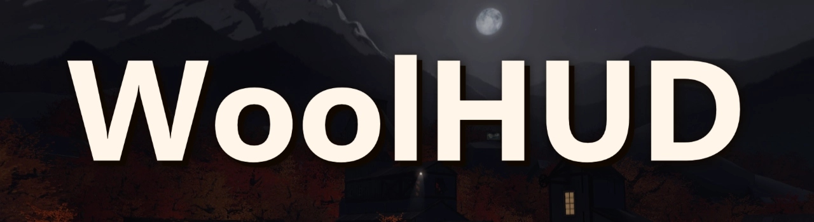

A replica of Woolen's TF2 HUD - a minimal, gameplay-focused HUD, with added customizations.

# Info

My goal is to try to make the best replica with as few bugs as possible. Some things are not faithful to the original HUD because they are either bugged or ugly.

By default the newest version is used. `#alternatives` contain elements from older versions. `#customizations` are not faithful to Woolen's original HUD.

# Recommended customizations

For the best possible experience, I recommend enabling:

**#alternatives**
- menu-normal-names-gamemenu.res
- main menu
- game timers
- control point
- objectivestatusescort.res

**#customizations**
- more themed elements
- options-classloadoutpanel.res
- cleaner buildings panels
- centered-metal-hudlayout.res
- centered mvm money
- payload race panel

[How to enable](https://github.com/Beventar/WoolHUD/wiki/Customizations)

# Thanks
- Woolen: Creating his HUD, Permission to publish

# Credits
- folks from [HUDS.tf Discord server](https://discord.com/invite/Hz3Q4Z8): General help
- [JarateKing](https://github.com/JarateKing): TF2 HUD files reference
- [Revan](https://github.com/cooolbros): TF2 HUD files reference, VS Code VDF plugin
- [Hypnotize](https://github.com/Hypnootize): Default HUD files, Updating Yahud Old
- [Whisker](https://github.com/rbjaxter): Elements from budhud
- [CriticalFlaw](https://github.com/CriticalFlaw): Elements from FlawHUD
- [Antwan](https://github.com/AsianAntwan): Class loadout panel from AntsHUD
- [Jakadak](https://github.com/jakadak): Elements from ahud-cc
- [Griever](https://steamcommunity.com/id/griiver/): Chat from ToonHUD
